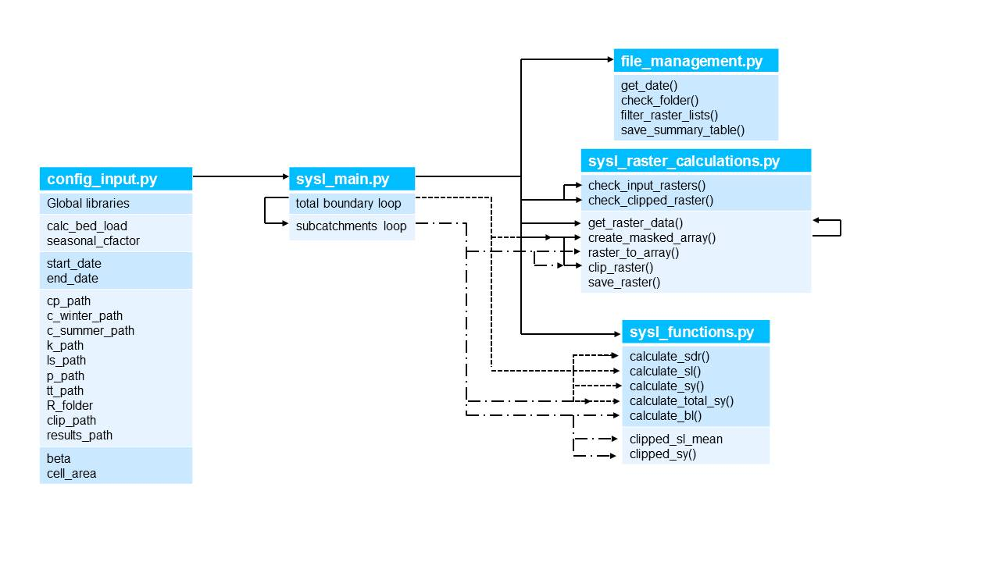

# Sediment load, yield and soil loss calculation based on RUSLE and SEDD

# Introduction

The module calculates the monthly pixel-specific soil loss (SL), the monthly pixel-specific sediment yield (SY) and the 
total monthly sediment yield for each sub-catchment based on the revised universal soil loss equation (RUSLE ([Renard, 1997](https://www.ars.usda.gov/arsuserfiles/64080530/rusle/ah_703.pdf)))
, using the sediment delivery distributed (SEDD, [(Ferro and Porto, 2000)](https://ascelibrary.org/doi/10.1061/%28ASCE%291084-0699%282000%295%3A4%28411%29)) 
model to estimate the sediment delivery. The sediment yield is defined as the sediment mass per unit time or 
sediment load that passes a defined boundary, such as the outlet of a sub-catchment. 
The bedload can be optionally guesstimated as a function of the suspended sediment transport rate 
[(Turowski et al., 2010)](https://ascelibrary.org/doi/10.1061/%28ASCE%291084-0699%282000%295%3A4%28411%29). 

## Libraries

*Python* libraries:  *gdal*, *numpy*, *pandas*

*Standard* libraries: *calendar*, *datetime*, *glob*, *re*, *os*, *sys*, *shutil*, *time*

## Input
The following input variables must be specified to run the code:

### General specifications

| Input argument | Type | Description |
|-----------------|------|-------------|
|`start_date`| STRING | Determines time interval for analysis (format: YYYYMM) |
|`end_date`| STRING | Determines time interval for analysis (format: YYYYMM)  |
|`calc_bed_load`| BOOLEAN | Optional bed load guesstimation  |
|`results_path`| STRING |Path of the main result folder|
|`beta`| FLOAT |catchment-specific beta parameter for the SEDD model|
|`pixel_area`| FLOAT |pixel area (ha)|

### Input raster and shape files

| Input argument | Type | Description |
|-----------------|------|-------------|
|`cp_path`| STRING | path for the land cover and management factor (.tif format) |
|`k_path`| STRING | path for the soil erodibility factor (.tif format)  |
|`ls_path`| STRING | path for the slope length and steepness factor (.tif format)  |
|`p_path`| STRING | path for the support practice factor (.tif format)  |
|`tt_path`| STRING | path for the travel time raster (.tif format)  |
|`r_folder`| STRING | path to the 'monthly' R factor rasters (.tif, date information must be included in the format YYYYMM)  |
|`clip_path`| STRING | path to the subcatchment shapes (format: Catchment_NAME.shp)  |

Please note: All raster files must have the same extent and pixel size (resolution).

## Output files

The output files for each sub-catchment as well as for the total catchment area are written to separate subfolders. 
These subfolders contain the monthly pixel-specific soil loss (`SL_YYYYMMM_Catchmentname.tif`), the monthly pixel-specific 
sediment yield (`SY_YYYYMMM_Name.tif`) and the total total monthly sediment yield for each sub-catchment 
(`SYTot_YYYYMMM_Catchmentname.tif`). 
For a clear presentation, an additional table is created for each subcatchment (`Catchmentname.txt`) showing the mean soil erosion, 
the mean sediment yield, and the sediment load or total sediment yield within the respective month. 
The bedload fraction can be optionally computed and written to the output table using an empirical equation.

Please note:
If observed suspended loads were used for calibration, the sediment yield represents the suspended sediment yield 
excluding bed load.

## Code Diagram

# Disclaimer

No warranty is expressed or implied regarding the usefulness or completeness of the information and documentation provided. References to commercial products do not imply endorsement by the Authors. The concepts, materials, and methods used in the algorithms and described in the documentation are for informational purposes only. The Authors has made substantial effort to ensure the accuracy of the algorithms and the documentation, but the Authors shall not be held liable, nor his employer or funding sponsors, for calculations and/or decisions made on the basis of application of the scripts and documentation. The information is provided "as is" and anyone who chooses to use the information is responsible for her or his own choices as to what to do with the data. The individual is responsible for the results that follow from their decisions.

This web site contains external links to other, external web sites and information provided by third parties. There may be technical inaccuracies, typographical or other errors, programming bugs or computer viruses contained within the web site or its contents. Users may use the information and links at their own risk. The Authors of this web site excludes all warranties whether express, implied, statutory or otherwise, relating in any way to this web site or use of this web site; and liability (including for negligence) to users in respect of any loss or damage (including special, indirect or consequential loss or damage such as loss of revenue, unavailability of systems or loss of data) arising from or in connection with any use of the information on or access through this web site for any reason whatsoever (including negligence).

# Authors
- Kilian Mouris
- Maria Fernanda Morales Oreamuno
- Sebastian Schwindt

